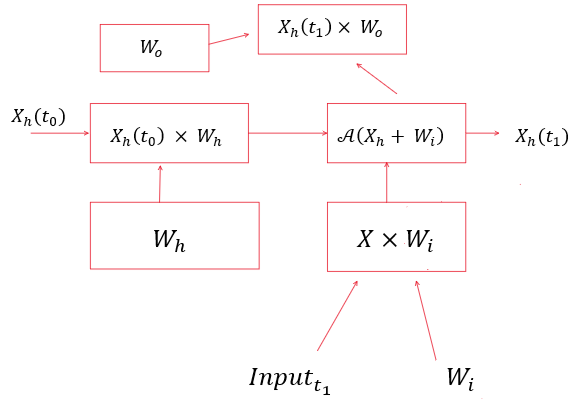
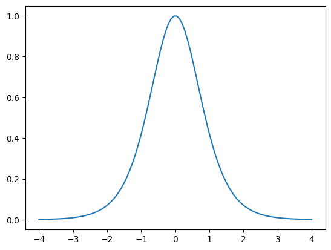
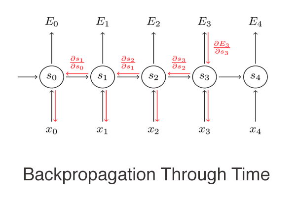
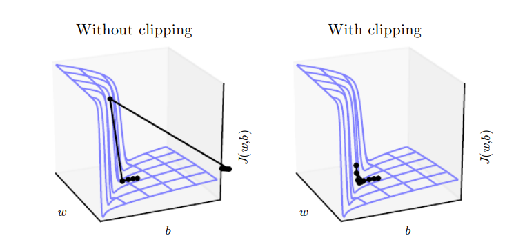

# RNN with attention

## RNN implementation

### Forward propagation:

The figure below illustrates the shared parameters of the rnn, used to compute the forward propagation for token $x^t$. The output is giving the unnormalized log probabilities over each possible output value $y$ for the input token $x^t$ given $x^1,x^1,....x^t$

    

### The loss function of the model

The total loss for is given by the sum of the losses over all time steps.
$$-\sum_{t}logp_m(y^t|x^1,....,x^t)$$

### The space complexity of the operations
In traditional Rnns the time and space complexity of a forward and backward pass is $$O(τ)$$ and cannot be reduced by parallelization (unless teacher forcing mechanism is used ). Since each step in the computation graph depends on the previous steps. The states computed in the forward pass must be stored until their used in the backward pass.

### Tanh is used as the activation function in Rnns :  

it allows for easier optimisation compared to a sigmoid activation for example
$1 - \tanh^2{x}$

    

### Backpropagation in Sequence models:

Gradients in rnns are computed using back-propagation algorithm. The computation starts at the end of the sequence, time step τ. After, we iterate backwards in time to back-propagate gradients through time.

    

### Vanishing and exploding gradient problems in sequence models:

When computing derivatives over a large number of time steps non linear functions such as tanh tend to have gradients that are either very large or very small in magnitude (multiplication of many Jacobians) (chain rule: the longer the maximum sequence length used in training, the more steps in the computational graph which results in multiple small values getting multiplied together most of the time and sometimes large values getting multiplied with each other causing an exploding gradient problem)

    

The above picture is taken from the book (deep learning by Ian Goodfellow), it demonstrates that gradient clipping, sometimes used in sequence models can enhance gradient descent performance in extremely steep regions of the objective function.
Gradient descent without clipping doesn't reach the bottom then gets a large update which propels the parameters outside the plot axes.
